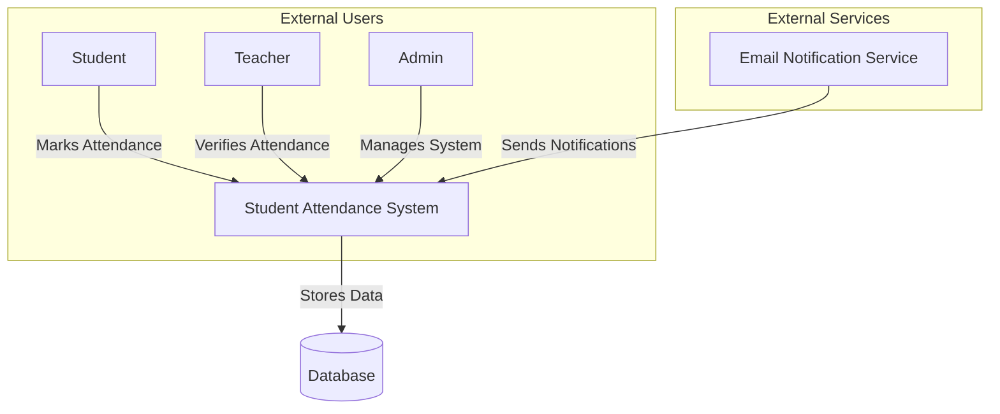
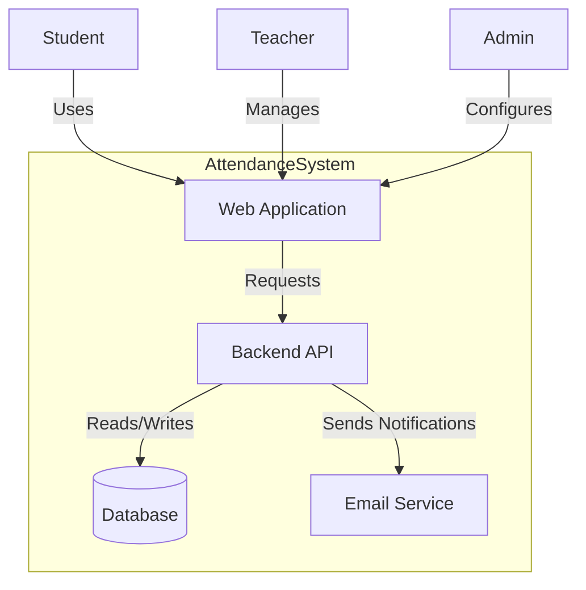
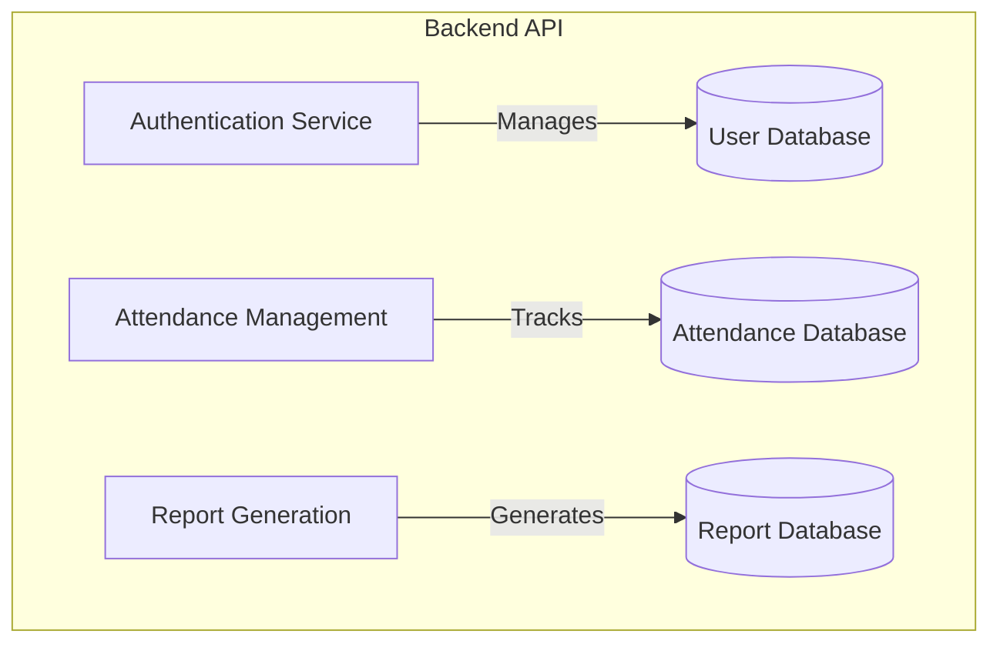
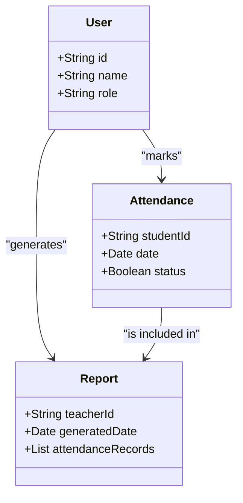

## C1: Context Diagram
### Student Attendance Management System

### Explanation:
- **Users:**
  - **Students** mark their attendance.
  - **Teachers** verify student attendance.
  - **Admins** manage users and system configurations.
- **External Services:**
  - **Email Service** sends attendance reports.
- **System Interactions:**
  - The **Attendance System** stores and retrieves attendance records from the **database**.

---

## C2: Container Diagram
### System Components

### Explanation:
- **Web Application:** Interface for users to interact with the system.
- **Backend API:** Handles logic and data processing.
- **Database:** Stores student attendance records.
- **Email Service:** Sends attendance reports.

---

## C3: Component Diagram
### Backend API Breakdown

### Explanation:
- **Authentication Service:** Manages user login and registration.
- **Attendance Management:** Handles marking and verifying attendance.
- **Report Generation:** Creates attendance reports for students and teachers.

---

## C4: Code Diagram
### Class Diagram Example

### Explanation:
- **User Class:** Represents students, teachers, and admins.
- **Attendance Class:** Stores attendance records.
- **Report Class:** Generates attendance reports.
