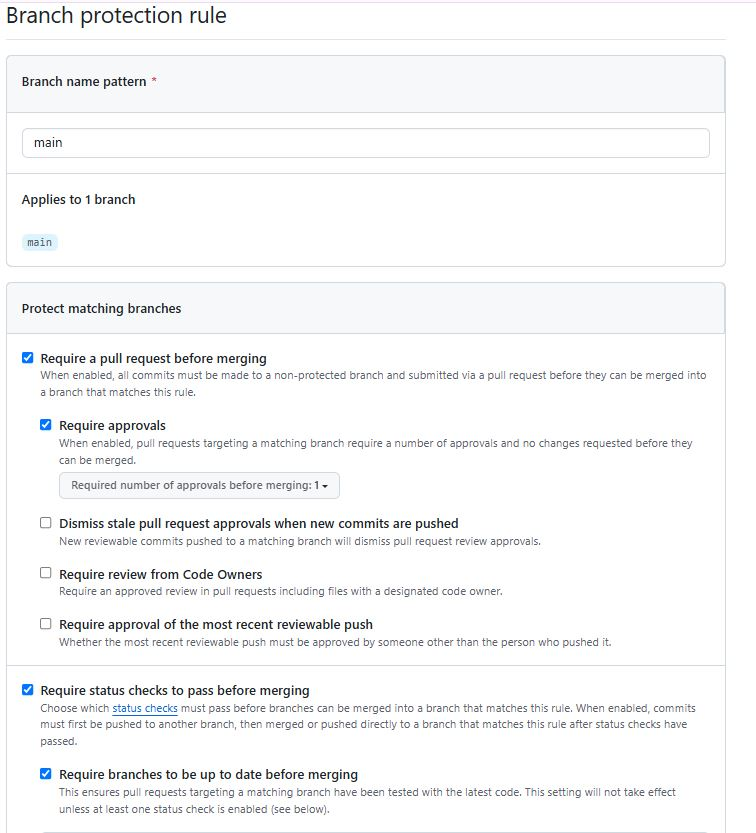
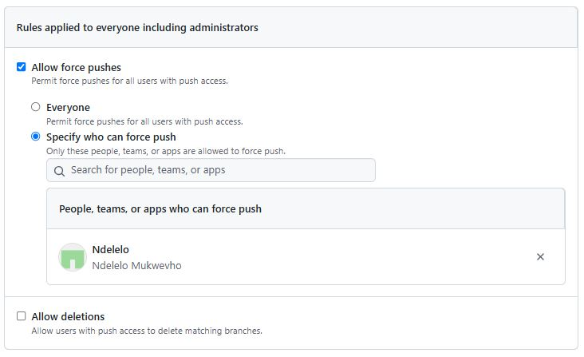

# Branch Protection Rules

This repository uses GitHub's **branch protection rules** to maintain a stable and secure `main` branch.

---

## 🔒 Rules Configured for `main`

### ✅ Require Pull Request Reviews
- At least **1 approval** is required before merging.
- Promotes peer review and reduces the chance of bugs.

### ✅ No Direct Pushes
- All changes must go through a **Pull Request (PR)**.
- Prevents accidental or unauthorized commits.

### ✅ Optional: Status Checks (CI)
- If CI is configured, PRs must pass before merging.
- Ensures code builds and tests run cleanly.

---

## 🖼️ Screenshots

### 🧩 Rule 1: Require Pull Request Review

---

### 🚫 Rule 2: Disable Direct Pushes

---

## 📌 Why These Rules Matter

- **Code Quality**: PRs allow reviews, improving code correctness and maintainability.
- **Security**: Protects the `main` branch from unauthorized or unsafe changes.
- **Stability**: Prevents broken code from being merged accidentally.
- **Transparency**: PRs create a clear record of all code changes and discussions.

---

By enforcing these rules, we ensure a consistent, collaborative, and secure development workflow.

