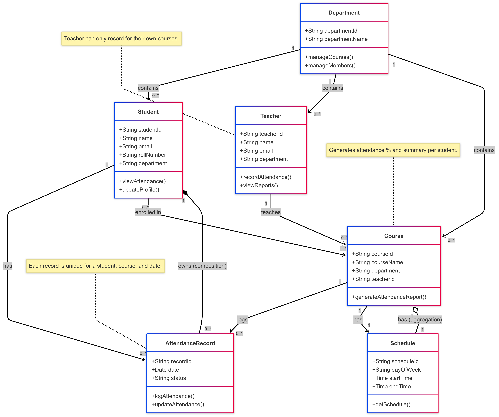

# Class Diagram Overview

---

### 1. Separation of Concerns via Entities
- **Why:** Each entity represents a distinct real-world concept such as `Student`, `Course`, and `Teacher`.
- **Benefit:** Promotes modularity and simplifies maintenance, allowing different parts of the system to evolve independently.

### 2. Use of `AttendanceRecord` as an Independent Entity
- **Why:** Attendance needs to be recorded per student, per course, per date.
- **Benefit:** Allows flexible tracking, querying, and reporting without duplication or data loss.

### 3. Many-to-Many Relationship Between Students and Courses
- **Why:** Students can enroll in multiple courses and each course has multiple students.
- **Benefit:** Reflects real-world enrollment scenarios; implemented using a join table if stored in a relational database.

### 4. Teacher Assigned Only to Their Courses
- **Why:** Ensures data integrity—only the responsible teacher can manage course-specific attendance.
- **Benefit:** Supports role-based access control and reduces errors in attendance handling.

### 5. Use of `Schedule` as a Separate Entity
- **Why:** Scheduling varies per course and needs to be maintained independently for flexibility.
- **Benefit:** Makes it easier to manage class times, avoid overlaps, and validate attendance dates.

### 6. Composition Between `Student` and `AttendanceRecord`
- **Why:** An attendance record has no meaning if the student is deleted.
- **Benefit:** Reflects lifecycle dependency; deleting a student should also delete their attendance records.

### 7. Aggregation Between `Course` and `Schedule`
- **Why:** A course depends on a schedule, but a schedule can exist independently.
- **Benefit:** Improves reusability and separation in scheduling logic.

### 8. `Department` as a Container for Core Entities
- **Why:** Academic institutions group people and courses by departments.
- **Benefit:** Enables better reporting, filtering, and organization based on academic structure.

### 9. `Attendance Status` as an Enum
- **Why:** Ensures consistent recording using predefined values (e.g., Present, Absent).
- **Benefit:** Simplifies logic for reports, statistics, and UI elements like color-coding.

### 10. Business Rules Enforced at Logical Level
- **Why:** Rules like 75% attendance requirement are business-driven and can change.
- **Benefit:** Keeps core model flexible while supporting rules at service or application level.
