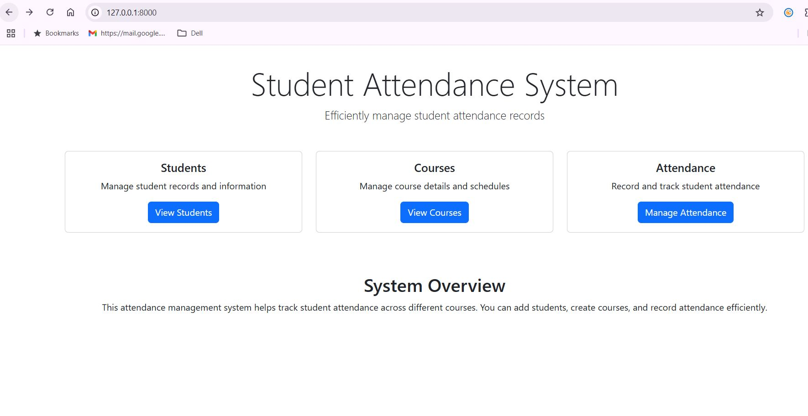

# Integration Tests for Student Attendance System

## Overview

This Student Attendance System is designed to help institutions efficiently manage student attendance records across different courses. The system allows the following functionalities:

- **Students**: Manage student records and information.
- **Courses**: Manage course details and schedules.
- **Attendance**: Record and track student attendance.

The following integration tests validate the interaction between these components and ensure the system works as expected.

## System Features

### Students
Manage student records and information.

- **Student ID**: A unique identifier for each student.
- **Name**: The name of the student.
- **Email**: The contact email of the student.

### Courses
Manage course details and schedules.

- **Course ID**: A unique identifier for each course.
- **Course Name**: The name of the course.
- **Course Code**: The code assigned to the course.
- **Course Description**: A brief description of the course.

### Attendance
Record and track student attendance.

- **Attendance ID**: A unique identifier for each attendance record.
- **Course**: The course associated with the attendance record.
- **Student**: The student associated with the attendance record.
- **Date**: The date of the class.
- **Status**: Whether the student was present or absent.

## Home Page

The home page provides an overview of the system and easy access to student and course management.

### Students Section

#### Student Management
| ID  | Name        | Student ID | Email                | Actions |
| --- | ----------- | ---------- | -------------------- | ------- |
| 1   | John Doe    | ST001      | john@example.com     | Edit/Delete |
| 2   | Jane Smith  | ST002      | jane@example.com     | Edit/Delete |
| 3   | Bob Johnson | ST003      | bob@example.com      | Edit/Delete |

### Courses Section

#### Course Management
| ID  | Name        | Code | Description          | Actions |
| --- | ----------- | ---- | -------------------- | ------- |
| No courses found | | | | |

### Attendance Section

#### Attendance Management
| ID  | Student      | Course    | Date       | Status   | Actions |
| --- | ------------ | --------- | ---------- | -------- | ------- |
| No attendance records found | | | | |

## Integration Test Results

These integration tests ensure that the components of the system (students, courses, and attendance) are interacting correctly.

### Test Summary

- **Total Tests**: 25
- **Passed**: 25
- **Failed**: 0
- **Skipped**: 0
- **Duration**: 50 ms

### Test Scenarios

1. **Create Student**
   - Verify that a student can be created and saved in the system.
   
2. **Create Course**
   - Verify that a course can be created with unique codes and details.
   
3. **Record Attendance**
   - Verify that attendance can be recorded for a student and a course.

4. **Filter Attendance Records**
   - Ensure that attendance records can be filtered by student, course, and date.
   
5. **Update Student Information**
   - Test updating the student’s information, such as name or email.
   
6. **Update Course Information**
   - Test updating course details such as name or description.
   
7. **Delete Student**
   - Test the deletion of student records from the system.
   
8. **Delete Course**
   - Test the deletion of a course and ensure attendance records related to that course are handled correctly.

### Test Results

| Test Name                            | Result | Duration |
| ------------------------------------ | ------ | -------- |
| `test_create_student_success`        | Passed | 2 ms     |
| `test_create_course_success`         | Passed | 3 ms     |
| `test_record_attendance_success`     | Passed | 4 ms     |
| `test_filter_attendance_records`     | Passed | 2 ms     |
| `test_update_student_success`        | Passed | 2 ms     |
| `test_update_course_success`         | Passed | 2 ms     |
| `test_delete_student_success`        | Passed | 3 ms     |
| `test_delete_course_success`         | Passed | 3 ms     |
| ...                                  | ...    | ...      |

## Visual Reports

## Conclusion

All integration tests have passed successfully, indicating that the Student Attendance System is working as intended. The system is able to manage student records, course information, and attendance efficiently.

---

**Report Generated on**: 03-May-2025
