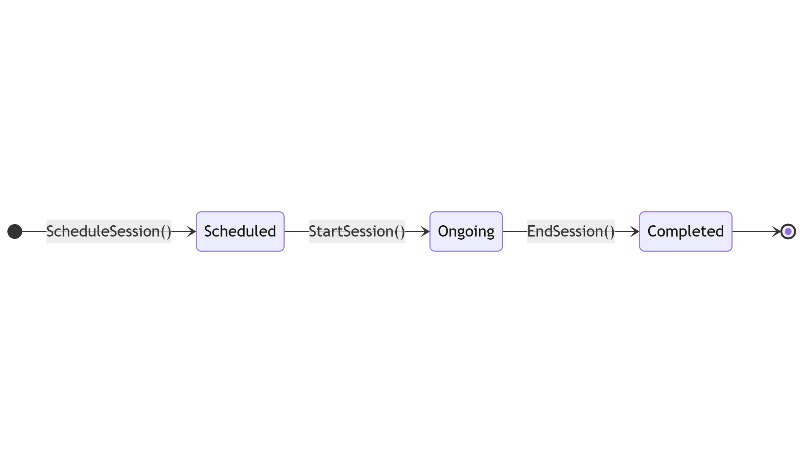

# Object State Modeling with State Transition Diagrams

## 1. Attendance Record

**Key States:**  
Initialized → Marked → Verified

**Diagram:**  

**Transitions:**
- `Initialize()` → Initialized  
- `MarkAttendance()` → Marked  
- `VerifyAttendance()` → Verified  

**Mapping to Functional Requirements:**
- **FR1:** The Marked state ensures that teachers can manually or automatically mark attendance.  
- **FR3:** The Verified state enables administrators to confirm attendance records before report generation.

## 2. Student

**Key States:**  
Registered → Active → (Graduated / Dropped)

**Diagram:**  

**Transitions:**
- `Register()` → Registered  
- `Enroll()` → Active  
- `Graduate()` → Graduated  
- `DropOut()` → Dropped  

**Mapping to Functional Requirements:**
- **FR2:** The Active state allows students to view their attendance records.  
- **FR4:** If a student is Dropped or absent for a session, the system can trigger alerts for parents.

---

## 3. Course

**Key States:**  
Created → Active → (Completed / Cancelled)

**Diagram:**  

**Transitions:**
- `CreateCourse()` → Created  
- `StartCourse()` → Active  
- `FinishCourse()` → Completed  
- `CancelCourse()` → Cancelled  

**Mapping to Functional Requirements:**
- **FR3:** Courses that reach the Completed state contribute to attendance report generation.  
- **FR5:** The Created state ensures courses are registered in the institution’s database.

---

## 4. Session

**Key States:**  
Scheduled → Ongoing → Completed

**Diagram:**  

**Transitions:**
- `ScheduleSession()` → Scheduled  
- `StartSession()` → Ongoing  
- `EndSession()` → Completed  

**Mapping to Functional Requirements:**
- **FR1:** The Ongoing state enables real-time attendance tracking.  
- **FR3:** The Completed state allows attendance data to be included in reports.

---

## 5. Teacher

**Key States:**  
Hired → Active → (Resigned / Retired)

**Diagram:**  

**Transitions:**
- `HireTeacher()` → Hired  
- `AssignCourse()` → Active  
- `ResignTeacher()` → Resigned  
- `RetireTeacher()` → Retired  

**Mapping to Functional Requirements:**
- **FR1:** The Active state ensures teachers can mark attendance.  
- **FR6:** The Hired state links to authentication and access control.

---

## 6. Admin

**Key States:**  
Created → Active → (Suspended / Removed)

**Diagram:**  

**Transitions:**
- `CreateAdminAccount()` → Created  
- `ActivateAccount()` → Active  
- `SuspendAccount()` → Suspended  
- `RemoveAccount()` → Removed  

**Mapping to Functional Requirements:**
- **FR3:** The Active state ensures administrators can generate reports.  
- **FR6:** The system supports multiple authentication methods for administrators.

---

## 7. Notification

**Key States:**  
Generated → Sent → Read

**Diagram:**  

**Transitions:**
- `GenerateNotification()` → Generated  
- `SendNotification()` → Sent  
- `ReadNotification()` → Read  

**Mapping to Functional Requirements:**
- **FR4:** Notifications in the Sent state ensure parents receive alerts for absences.

---

## 8. Report

**Key States:**  
Created → Reviewed → (Approved / Rejected)

**Diagram:**  

**Transitions:**
- `GenerateReport()` → Created  
- `ReviewReport()` → Reviewed  
- `ApproveReport()` → Approved  
- `RejectReport()` → Rejected  

**Mapping to Functional Requirements:**
- **FR3:** The Approved state confirms valid attendance reports.  
- **FR5:** Integration with the institution’s database ensures reports are stored properly.
