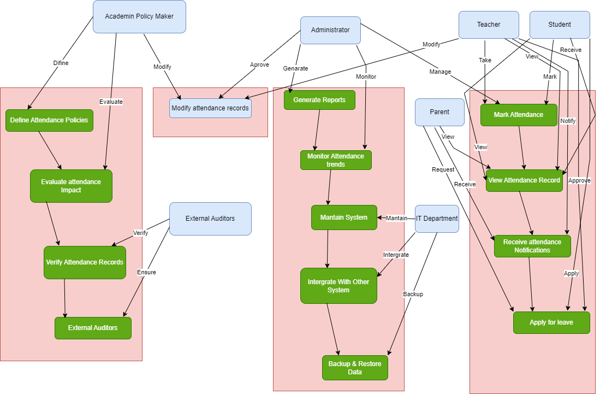

## Use Case Diagram

## Key Actors and Their Roles

### **1. Student**
- Marks their attendance.
- Requests leave for absence (approved/rejected by teacher).
- Verifies attendance records and reports discrepancies.
- Ensures accuracy in attendance tracking.

### **2. Teacher**
- Takes and updates attendance records.
- Views attendance data.
- Approves or rejects student leave requests.
- Modifies attendance records for errors.
- Ensures accurate attendance tracking.

### **3. Administrator**
- Manages the overall system.
- Generates attendance reports and monitors trends.
- Ensures compliance with attendance policies.
- Works with teachers for attendance correction and reporting.
- Addresses system issues and updates.

### **4. Parent**
- Monitors student attendance records.
- Communicates with teachers for attendance concerns.
- Helps improve student discipline and punctuality.
- Submits leave requests on behalf of the student.

### **5. IT Department**
- Manages technical aspects of the system.
- Maintains system security.
- Handles data backups and recovery.
- Works with administrators for system configurations.
- Integrates with learning management systems.

### **6. External Auditors**
- Verify accuracy of attendance records.
- Ensure compliance with regulations.
- Access tamper-proof attendance logs.
- Generate compliance reports for legal and academic review.

### **7. Academic Policymakers**
- Define institutional attendance policies.
- Evaluate attendance impact on academic performance.
- Enforce regulations based on auditor reports.
- Ensure universities/colleges follow attendance regulations.
